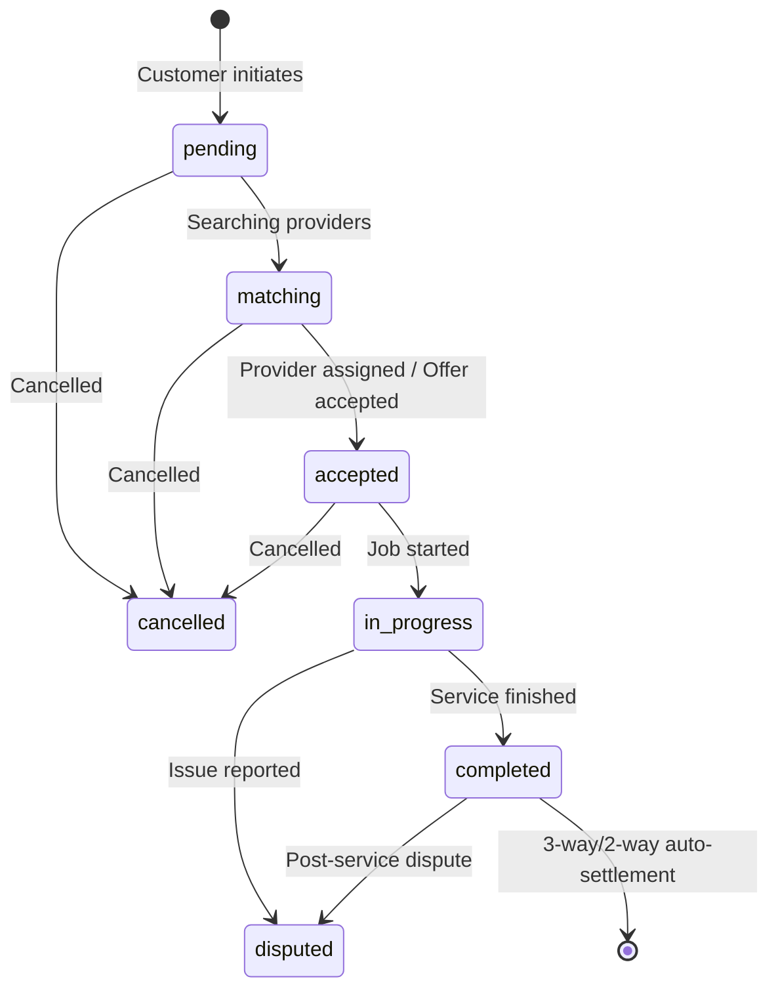

# MoveX Backend — Comprehensive Clean Architecture & Security Guide

## 1. Executive Summary & Core Philosophy

**MoveX Backend** is an enterprise-grade, unified backend platform built with **Node.js, TypeScript, Express, Prisma ORM, and PostgreSQL**. It consolidates four distinct on-demand verticals into a single cohesive architecture:
1. **MoveX Food & Grocery**: Fixed-price restaurant and grocery ordering with immediate courier dispatch.
2. **MoveX Ride**: On-demand passenger transit with real-time bidding between passengers and drivers.
3. **MoveX Handyman**: Home trades and services (Plumbing, Electrical, Carpentry) with classification-aware contractor bidding.
4. **MoveX Logistics & Moving**: Heavy cargo, equipment, and relocation services with strict vehicle capacity hierarchy enforcement.

### The Golden Rule of Separation
```
+-------------------------------------------------------------------+
|                        SHARED CORE LAYER                          |
|  auth | rbac | wallet | order-engine | sockets | proximity | ai   |
+-------------------------------------------------------------------+
       ▲                  ▲                    ▲                 ▲
       │                  │                    │                 │
+--------------+   +--------------+   +------------------+   +---------------+
|    FOOD      |   |     RIDE     |   |     HANDYMAN     |   |    MOVING     |
|   MODULE     |   |    MODULE    |   |      MODULE      |   |    MODULE     |
+--------------+   +--------------+   +------------------+   +---------------+
       │                  │                    │                 │
       └──────────────────┴─────────┬──────────┴─────────────────┘
                                    ▼
                         +--------------------+
                         |   BIDDING LAYER    |
                         |  (Ride + Handyman) |
                         +--------------------+
```
- **Shared Core** is the foundation: Modules import from Core; Core never imports from any module.
- **Cross-Module Isolation**: No module may directly import from or depend on another module. All inter-service communication flows through the Core Event Bus and Order Engine.
- **Single Source of Truth**: No module writes directly to the `Order` or `WalletTransaction` tables. All state mutations are governed by the Core Order Engine and Core Wallet.

---

## 2. Security Architecture & Threat Mitigation

### 2.1 HTTP Security Headers & Cross-Site Protection
- **Helmet Middleware**: Configures HTTP response headers (`X-Content-Type-Options: nosniff`, `X-Frame-Options: SAMEORIGIN`, `Strict-Transport-Security`, `X-XSS-Protection`).
- **CORS Hardening**: Strict origin whitelist based on environment configuration (`CORS_ORIGIN`).

### 2.2 Rate Limiting & Anti-Brute-Force Pipeline
Implemented via `express-rate-limit` with differentiated tiers:
1. **Global API Limiter**: 1,000 requests per 15 minutes per IP.
2. **Auth Limiter**: 25 attempts per 15 minutes on `/api/auth/login` and `/api/auth/register` to mitigate credential stuffing and dictionary attacks.
3. **Financial Wallet Limiter**: 30 requests per minute to prevent race-condition exploits or rapid transaction spam.

### 2.3 Role-Based Access Control (RBAC) with In-Memory Caching
- **Multi-Role User Architecture**: One user can hold multiple roles simultaneously (`customer`, `driver`, `worker`, `partner`, `admin`, `supervisor`).
- **Granular Permission Checks**: Routes are protected by permissions (e.g. `requirePermission('order.cancel')`, `requirePermission('wallet.payout.approve')`), not hardcoded role strings.
- **In-Memory TTL Cache**: Role-to-permission lookups are cached with a 5-minute TTL, eliminating repetitive database queries on high-frequency routes.

### 2.4 Idempotency & Zero-Overdraft Wallet Concurrency
- **Zero-Overdraft Enforcement**: Debit operations verify real-time balance inside an atomic PostgreSQL `$transaction`. If the balance is insufficient, a typed `InsufficientFundsError` is thrown before any mutation occurs.
- **Settlement Idempotency**: Order settlement checks for an existing commission record for the target order ID before executing, guaranteeing that duplicate webhooks or retries never result in duplicate payouts.
- **Immutable Audit Trail**: Every transaction records both the pre-balance and post-balance in the ledger.

---

## 3. Core Subsystems

### 3.1 Order Engine State Machine (`core/order-engine`)
The Order Engine governs all lifecycle transitions through explicit validation rules:


### 3.2 Geospatial Proximity & Haversine Engine (`core/proximity`)
- Implements the Haversine great-circle formula in pure TypeScript for sub-millisecond calculation of geographical distance between coordinates.
- Calculates dynamic ETA based on urban transit factors (30 km/h baseline).
- Supports proximity search with multi-dimensional filtering (`serviceCategoryId`, `vehicleTypes`, `maxDistanceKm`).

### 3.3 Domain Event Bus (`core/events`)
Decoupled event emitter pattern with typed events:
- `order:status_changed`: Broadcasts real-time socket events and sends push/in-app notifications to customer and provider.
- `bidding:offer_accepted`: Alerts winning provider and notifies losing bidders.
- `wallet:transaction`: Triggers audit and ledger indexing.

---

## 4. Bidding Layer & Realtime Negotiation Room

Used exclusively by **Ride** and **Handyman**:
1. **Request Opening**: Customer opens a request via `POST /bidding/requests`. This does **NOT** touch the `Order` table.
2. **Provider Dispatch**: Eligible nearby providers receive a socket event `bidding:new_request`.
3. **Offer Submission**: Competing providers submit offers via `POST /bidding/requests/:id/offers`.
4. **Offer Acceptance & Order Creation**: When the customer accepts an offer via `POST /bidding/offers/:id/accept`, the Order Engine is invoked atomically:
   - The agreed price and chosen provider are populated into the new `Order`.
   - Competing pending offers for that request are automatically transitioned to `rejected`.
   - Real-time updates are emitted to the bidding room.

---

## 5. Vehicle Capacity Hierarchy (`modules/moving`)

Moving jobs enforce a strict vehicle capacity ordering:
$$\text{sedan (1)} < \text{pickup (2)} < \text{van (3)} < \text{small\_truck (4)} < \text{large\_truck (5)}$$

- **Golden Rule**: A smaller vehicle is **never** matched to a job requiring higher capacity.
- If an order requests `requiredVehicleType: large_truck`, only providers with `large_truck` are matched.
- If an order requests `requiredVehicleType: van`, providers with `van`, `small_truck`, or `large_truck` are eligible.

---

## 6. Centralized Error Handling & Response Standards

Every endpoint returns a predictable standard JSON envelope:

### Successful Response
```json
{
  "success": true,
  "data": { ... },
  "meta": {
    "timestamp": "2026-09-25T16:02:53.123Z",
    "requestId": "550e8400-e29b-41d4-a716-446655440000"
  }
}
```

### Error Response
```json
{
  "success": false,
  "error": {
    "code": "INSUFFICIENT_FUNDS",
    "message": "Insufficient wallet balance: Current balance is $50.00, requested $100.00",
    "details": { "currentBalance": 50, "requestedAmount": 100 }
  },
  "meta": {
    "timestamp": "2026-09-25T16:02:53.123Z",
    "requestId": "550e8400-e29b-41d4-a716-446655440000"
  }
}
```

---

## 7. Interactive API Documentation

Interactive OpenAPI 3.0 documentation is powered by **Swagger UI** and available locally at:
```
http://127.0.0.1:4000/api-docs/
```
All endpoints, schemas, authentication headers, and request/response models are fully documented and testable in the browser.
